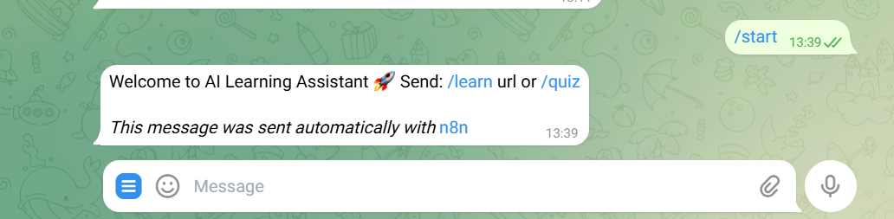
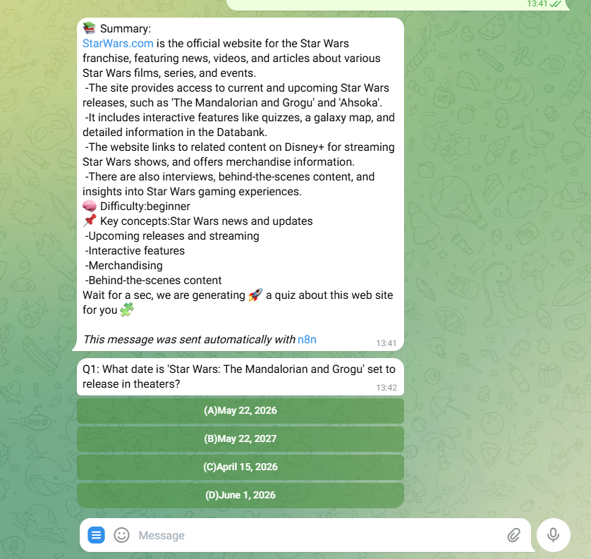

# Telegram AI Learning Bot

AI-powered Telegram bot for learning from articles and testing knowledge with quizzes.

@quizgen2026bot

## Features

- Learn from any article or webpage via URL
- AI-generated summaries with key concepts and difficulty level
- Automatically generated quiz questions
- Interactive multiple choice quizzes
- Answer validation with explanations
- Persistent user progress and saved materials

---

# Commands

## `/start`

Starts the bot and shows available commands.

---

## `/learn [url]`

Submit a webpage or article URL to study.

Example:

/learn https://ventionteams.com

What happens:

The bot fetches and extracts the article content
The Teacher AI analyzes the material
A structured summary is generated:
5–7 key points
main concepts
difficulty level
The material is saved for future quizzes

/quiz

Start a quiz based on previously saved learning materials.

What happens:

The bot shows a list of saved topics (max 10)
You choose a topic
The Examiner AI generates 5 unique multiple choice questions
Questions are sent one by one with inline buttons
Your answers are validated
Final score (percentage) and explanations for each question are provided

